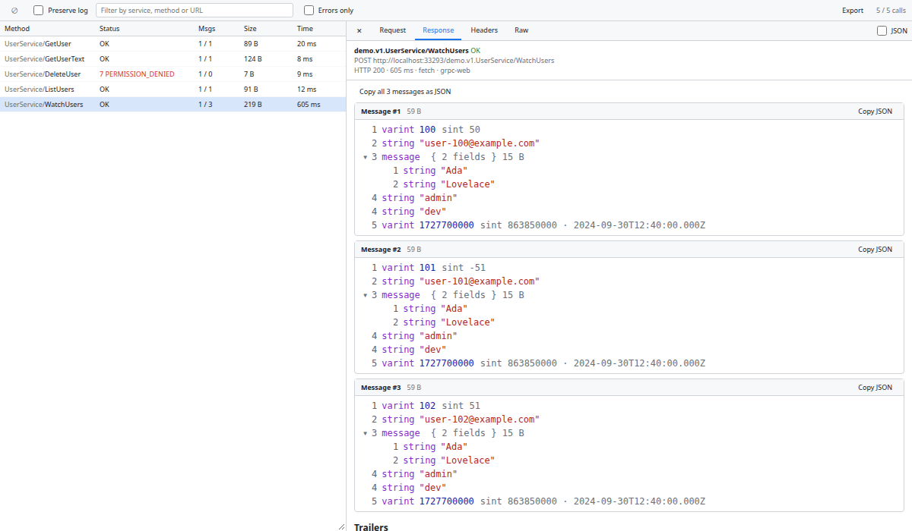

# gRPC Inspector

DevTools panel for Brave, Chrome and Edge that shows every **gRPC-Web** and **Connect** call made by a page, with the protobuf messages decoded — **no changes to your app and no `.proto` files needed**.



## Why another one

The public gRPC devtools extensions only work if the app registers an interceptor (`__GRPCWEB_DEVTOOLS__`, `enableDevTools(...)`), so on most real apps the panel stays empty. This one wraps `fetch` and `XMLHttpRequest` from the extension itself (MV3 content script in the page's main world, at `document_start`), so it works with any client: `grpc-web`, `@improbable-eng/grpc-web`, `@connectrpc/connect-web`, protobuf-ts, hand-written fetch…

## What it decodes

| Protocol | Content-Type | Notes |
| --- | --- | --- |
| gRPC-Web binary | `application/grpc-web`, `application/grpc-web+proto` | messages + trailers frame |
| gRPC-Web text | `application/grpc-web-text` | base64 streams with per-chunk padding |
| Connect streaming | `application/connect+proto`, `+json` | end-stream frame with error details |
| Connect unary | `application/proto`, `application/json` | detected by `connect-protocol-version` or `/pkg.Service/Method` path |
| Compressed frames | `grpc-encoding: gzip` / `deflate` | via `DecompressionStream` |

- **Schemaless protobuf decoding**: field numbers, wire types, nested messages, repeated fields, packed varints, signed/zigzag/bool hints, float/double views, timestamp hints. Ambiguous bytes (a string that is also a valid message) can be flipped with *as message*.
- **Streaming**: server-streaming calls update live, message by message.
- **Status**: `grpc-status` / `grpc-message` from trailers, trailers-only responses, Connect end-stream and Connect unary errors.
- Tree or JSON view, copy a message or a whole stream as JSON, hex dump, export all calls to a JSON file, filter, errors only, preserve log.
- Calls made before the panel was opened are kept (per-tab buffer in the service worker).
- Requests the page hooks cannot see (Web Workers) are picked up from the DevTools network log as a fallback (request bytes may be less exact there).

## Install (unpacked)

1. `git clone https://github.com/lucasmoyano-septeo/grpc-inspector.git`
2. Open `brave://extensions` (or `chrome://extensions`), enable **Developer mode**.
3. **Load unpacked** → pick the `src/` folder.
4. Reload the page you want to inspect, open DevTools → **gRPC** tab.

## Development

```bash
npm install
npm test            # decoder unit tests (node:test)
npm run test:e2e    # loads the extension in Chromium and checks the panel against a demo server
node test/server.mjs  # demo page with gRPC-Web / Connect calls on http://localhost:8787
npm run zip         # grpc-inspector.zip ready for the Chrome Web Store
```

Layout:

- `src/inject.js` — page-world hooks for `fetch` / XHR, copies request and response bytes.
- `src/bridge.js` — isolated-world relay to the service worker.
- `src/background.js` — per-tab buffer and fan-out to open panels.
- `src/panel.*` — the DevTools panel UI.
- `src/lib/decode.js` — framing, gRPC-Web text, trailers and protobuf wire decoding (no DOM, unit-tested).

## Limits

- No field names: without descriptors the decoder shows field numbers. Loading a `FileDescriptorSet` is a possible next step.
- Bodies over 10 MB are truncated.
- Native gRPC over HTTP/2 does not exist in browsers, so only gRPC-Web / Connect traffic is visible.

## License

MIT
